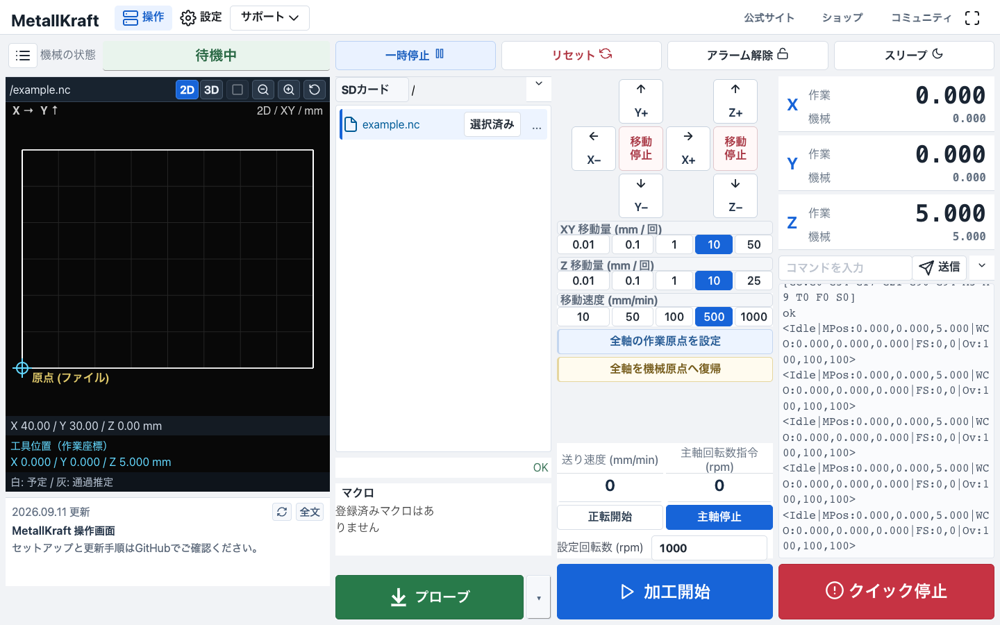

# MetallKraft UI for FluidNC

**FluidNCで動くCNCのための、日本語Web UIです。MetallKraftの機械やMKS製ボード以外でも使えるように公開しています。**

自分の機械設定はそのままに、操作画面だけを導入できます。日本語のジョグ操作、SDファイル選択、大きな加工開始・クイック停止、加工予定経路の表示を使えます。MetallMeisterが開発・公開しています。

**[最新版 v0.1.12をダウンロード（ZIP）](https://github.com/MetallMeister/metallkraft-fluidnc/releases/download/v0.1.12/metallkraft-ui-v0.1.12.zip)** · **[過去のバージョン一覧・ダウンロード](docs/VERSIONS.md)**

**[はじめての導入手順](docs/INSTALL.md)** · **[更新・元に戻す](docs/UPDATE.md)**

**[Releasesで全バージョンを見る](https://github.com/MetallMeister/metallkraft-fluidnc/releases)** — 各版のAssetsにある `metallkraft-ui-v*.zip` が導入用です。

利用前に[免責事項・安全上の注意](docs/DISCLAIMER.md)を確認してください。本ソフトウェアは適用法令で認められる範囲で無保証です。クイック停止は物理的な非常停止の代わりにはなりません。

## 自分のボードで使う

基板を交換したり、同梱YAMLへ変更したりする必要はありません。**正常動作しているFluidNCと、自分のボード・機械用のYAMLを使ってください。**

| 目的 | 使うファイル |
| --- | --- |
| 初めてこのUIを導入する | `install/ui/` の7ファイル。YAMLは変更しない |
| このUIを更新する | [更新手順](docs/UPDATE.md)。既存の表示設定・マクロを維持 |
| 対応するMAX基板の設定例も使いたい | 任意の[基板設定例](docs/BOARD.md)。UI導入には不要 |

**FluidNCのファームウェア本体は含めません。** 本体は[公式Web Installer](https://installer.fluidnc.com/fluidnc)から導入します。YAMLと`preferences.json`だけではこのカスタム画面にならないため、画面本体の`index.html.gz`等も同梱しています。

### 利用条件と確認状況

| 項目 | 条件・確認状況 |
| --- | --- |
| ファームウェア | 基準版はFluidNC v4.0.3 Wi-Fi版。他バージョンは未検証 |
| 基板 | 特定メーカー専用ではありません。現在の基準環境はMKS DLC32 MAX V1.0_002 / ESP32-S3で、他基板の動作保証はしていません |
| Web UI | WebUI-3 v3.0.10を基にしています。ブラウザで基板へ接続して使用 |
| 機械構成 | XYZのCNC向け。原点復帰・プローブ・主軸は各自のYAMLと配線の設定が必要 |
| 加工ファイル | このUIのファイル選択・プレビュー・加工開始は、FluidNCが認識するSDカードが前提 |
| 保存先 | UIは基板のFlashに保存。既存ファイルをバックアップし、空き容量を確認 |

GRBL・grblHALなど、FluidNC以外のファームウェア用UIではありません。ボードごとのピン設定や校正をUIが代行するものでもありません。

## 導入の流れ

1. ZIPを展開し、[導入手順](docs/INSTALL.md)を開く。プログラミングやビルドは不要です。
2. 機械を停止し、既存の画面・表示設定・YAMLをバックアップする。
3. `install/ui/`内の7ファイルを**基板のFlash直下**へアップロードする。SDではありません。**YAMLやファームウェアは変更しません。**
4. ブラウザを再読み込みして表示を確認する。初回導入で置き換わる表示設定・マクロは、バックアップを参照して再設定する。

加工用GコードはSDカードへ。`install/`フォルダ自体やZIPを基板へ送るのではなく、指定した中身のファイルを送ります。

FluidNCをまだ導入していない場合は、先に公式手順で**自分の基板に合うファームウェアと機械設定**を用意してください。UIのためにMAX用ファームウェアやYAMLを流用しないでください。

## 配布内容

- **画面**: 白・灰・青を基調にしたMetallKraft UI、日本語表示、サイト・ショップ・コミュニティへのリンク。
- **主軸操作**: 青い「主軸開始」が、基板の指令状態に応じて点滅する「主軸停止」へ切り替わります。実回転の検出ではありません。
- **停止後の案内**: 左下に復帰手順を表示し、次に押すボタンを青枠で示します。自動解除・自動運転は行いません。
- **初期値**: XY/Z移動量10 mm、ジョグ速度500 mm/min。初回の実移動確認は0.01 mmなど小さな値へ変更してください。
- **経路表示**: 白が予定経路、灰が位置報告に基づく通過推定。機械の誤差や実切削、衝突の有無は判定できません。
- **マクロ**: 主軸操作の下に最大6個を表示し、それ以上は枠内でスクロールします。公開版は空で、動作確認用の仮マクロは含めません。
- **設定の分離**: Wi-Fi名・パスワード、個別機の接続先IP、加工データ、作業履歴は含みません。

基準環境はFluidNC v4.0.3 / WebUI-3 v3.0.10です。画面とブラウザ側処理を変更していますが、FluidNCファームウェアは変更せず、コマンド送信は標準WebUIの仕組みを使用します。CSSだけの変更ではありません。[変更範囲と制限](docs/DEVELOPMENT.md)も確認してください。

画面の「クイック停止」は通信に依存するソフト停止です。**電源を遮断する物理的な非常停止の代わりにはなりません。**

## 開発・ライセンス

通常の利用者は`standard/`、`src/`、`vendor/`を基板へ送る必要はありません。これらは保守・再ビルド用です。

[開発手順](docs/DEVELOPMENT.md) · [ライセンスと出典](THIRD_PARTY.md) · [GPL-3.0](LICENSE)

改変元WebUIの対応ソースも同梱しています。FluidNCの全ソースやファームウェアは同梱していません。

## 動作報告・参加

他のボードでの利用・動作報告も歓迎します。[GitHub Issues](https://github.com/MetallMeister/metallkraft-fluidnc/issues)または[コミュニティ](https://cnc-lab.metallmeister.net/)へ、ボード名・FluidNC版・ブラウザ・確認した機能を添えてください。MetallKraftの機械を使っている必要はありません。パスワードや個人の加工データは公開しないでください。

### 任意の基板設定例

`install/boards/`はUIとは別の設定例です。同梱YAMLは**MKS DLC32 MAX V1.0_002 / ESP32-S3専用**で、通常のDLC32や他基板には使えません。未校正で、原点復帰・リミット・プローブ・主軸制御・冷却は未設定です。[設定例の前提と注意点](docs/BOARD.md)を確認してください。

[MetallMeister](https://metallmeister.net/) · [ショップ](https://metallmeister.stores.jp/) · [コミュニティ](https://cnc-lab.metallmeister.net/)
